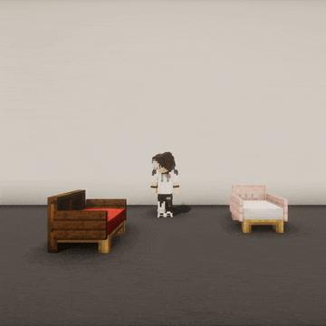
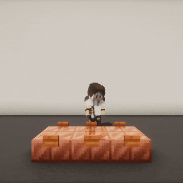
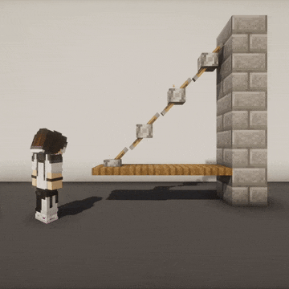
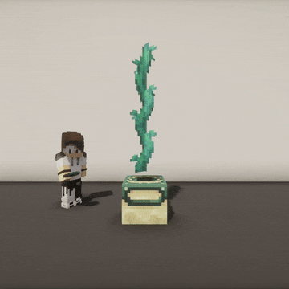
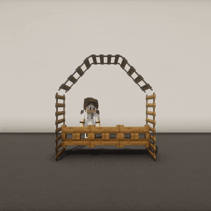

# Keep Illegal Blocks

[](https://github.com/Atrimilan/KeepIllegalBlocks/actions/workflows/release.yml)
&nbsp;[](https://modrinth.com/project/i4WvDCnD)
&nbsp;[](https://github.com/Atrimilan/KeepIllegalBlocks/blob/master/LICENSE)

Paper plugin that prevents illegal blocks from breaking when a player interacts with an adjacent block.

<table>
  <tr>
    <td></td>
    <td></td>
  </tr>
</table>


<details>
<summary><b>🖼️ Click to see more examples</b></summary>
<br/>

There you go 😎:

<table>
  <tr>
    <td></td>
    <td></td>
    <td></td>
  </tr>
  <tr>
    <td></td>
    <td></td>
    <td></td>
  </tr>
  <tr>
    <td></td>
    <td></td>
    <td></td>
  </tr>
</table>

</details>

## Overview

### 1. So what's the point?

"**Fragile blocks**" are illegal blocks that cannot normally be placed and are automatically broken by Minecraft
physics. These **fragile blocks** can be placed using a Debug Stick or plugins such as WorldEdit or Axiom.

"**Interactable blocks**" are blocks that can be directly interacted with _(using right-click)_, and can cause
**fragile blocks** to break.

Interacting with an **interactable block** triggers a physical update that propagates through all chained
**fragile blocks**, causing them to break. **--> This plugin prevents this behavior.**

<details>
<summary><b>🔵 Expand list of fragile block categories</b></summary>
<br/>

List of fragile block categories that are automatically restored by the plugin when broken:

* `amethyst-clusters`
* `banners`
* `beds`
* `bells`
* `cactus`
* `cakes`
* `carpets`
* `cave-vines`
* `chorus-plants`
* `cocoa`
* `comparators`
* `corals` _(does not apply to waterlogged corals)_
* `crops`
* `dead-bushes`
* `doors`
* `dripleaves`
* `ferns`
* `flowers`
* `frogspawn`
* `fungus`
* `glow-lichens`
* `grass`
* `hanging-roots`
* `hanging-signs`
* `ladders`
* `lanterns`
* `lily-pads`
* `mangrove-propagules`
* `mushrooms`
* `nether-roots`
* `nether-sprouts`
* `nether-warts`
* `pointed-dripstones`
* `pressure-plates`
* `rails`
* `redstone-wires`
* `repeaters`
* `saplings`
* `scaffolding`
* `sculk-veins`
* `sea-pickles`
* `signs`
* `snow`
* `sugar-canes`
* `sweet-berry-bushes`
* `switches` _(levers and buttons)_
* `torches`
* `tripwire-hooks`
* `twisting-vines`
* `vines`
* `weeping-vines`

</details>

<details>
<summary><b>🔴 Expand list of interactable block categories</b></summary>
<br/>

List of interactable blocks categories recorded by the plugin:

* `campfires`
* `candles`
* `cauldrons`
* `comparators`
* `composters`
* `copper-blocks` _(non-plain copper blocks that can be waxed or scraped)_
* `daylight-detectors`
* `doors`
* `end-portal-frames`
* `gates`
* `lecterns` _(putting a book on them)_
* `repeaters`
* `switches` _(levers and buttons)_
* `trap-doors`

</details>

> [!WARNING]
> At the moment, the plugin does **not** support naturally-updating fragile blocks that are directly adjacent to
> other naturally-updating fragile blocks.
> If these conditions are met, blocks such as a growing cactus or a non-waterlogged dying coral will still cause
> other fragile blocks to update and break.
>
> The plugin also does **not** support waterlogged blocks, this includes `seagrass` and `kelp`.

### 2. Why would I need it?

This may seem niche, but it can be very useful for specific builds made using plugins like WorldEdit or Axiom,
especially when using custom resource packs that significantly change block textures and models.

This may also interest you if other players come onto your map and are likely to interact with your builds and break
everything accidentally... 😅

### 3. How does it work?

Technically, the plugin detects player interactions with interactable blocks and performs a
[BFS](https://en.wikipedia.org/wiki/Breadth-first_search) to record all chained fragile blocks,
and it restores any that have been broken.

For performance reasons, a block limit is set, which is **500 by default**.

## Admin guide

### 1. Installation

Download the plugin from Modrinth: https://modrinth.com/project/i4WvDCnD

Place the JAR file in the `./plugins` directory of your server

### 2. Configuration

You can edit `./plugins/KeepIllegalBlocks/config.yml` if you want to blacklist some fragile or interactable blocks.

To reload your configuration, use the `/kib reload` command (it requires the `kib.reload` permission for a non-op
player).

## Developer guide

### 1. Run a local server

This project includes the jpenilla's [run-task](https://github.com/jpenilla/run-task) Gradle plugin,
which allows you to run a local Paper server.

* Run the following to build the plugin and run a local server that includes it:
  ```sh
  ./gradlew runServer
  ```
  By default, the server will start at `localhost:25565`, but you can configure server properties
  in [build.gradle.kts](build.gradle.kts).

### 2. Build the JAR file

Building the plugin's JAR works as usual:

* Use either:
  ```sh
  ./gradlew build
  ```
* Or if you don't want to run unit tests:
  ```sh
  ./gradlew assemble
  ```

### 3. Enable debug mod

You can enable debug mode with the following flags:

* If you are using the `runServer` Gradle task, add the following Gradle script parameter in your run configuration:
  ```sh
  -Pkeepillegalblocks.debug
  ```
* Otherwise, simply add the following JVM argument to your Minecraft server:
  ```sh
  -Dkeepillegalblocks.debug=true
  ```
