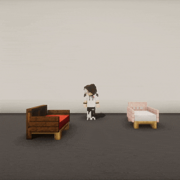
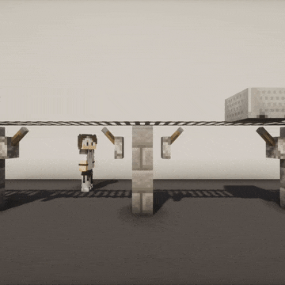
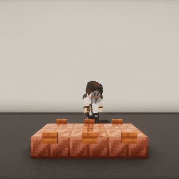
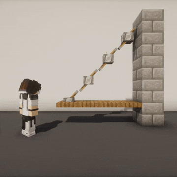
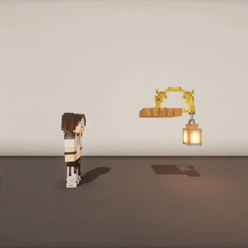
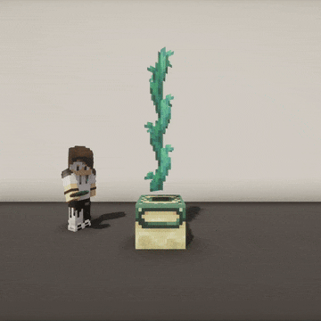
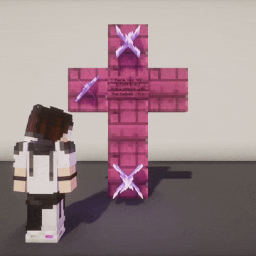
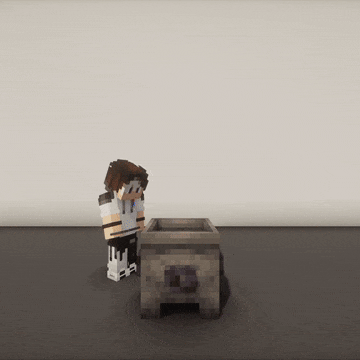
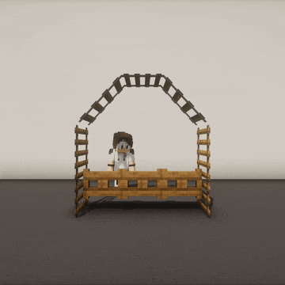

# Keep Illegal Blocks

[](https://github.com/Atrimilan/KeepIllegalBlocks/actions/workflows/release.yml)
&nbsp;[](https://modrinth.com/plugin/keep-illegal-blocks)
&nbsp;[](https://github.com/Atrimilan/KeepIllegalBlocks/blob/master/LICENSE)

Paper plugin that prevents illegal blocks from breaking or being updated when a player interacts with an adjacent
block.

<table>
  <tr>
    <td></td>
    <td></td>
  </tr>
</table>

<details>
<summary><b>🖼️ Click to see more examples</b></summary>
<br/>

There you go 😎:

<table>
  <tr>
    <td></td>
    <td></td>
    <td></td>
  </tr>
  <tr>
    <td></td>
    <td></td>
    <td></td>
  </tr>
  <tr>
    <td></td>
    <td></td>
    <td></td>
  </tr>
</table>

</details>

## Overview

### 1. So what's the point?

A **"reactive block"** is a block that naturally updates or breaks due to Minecraft physics when an adjacent block is
modified. When using tools like a Debug Stick or plugins such as WorldEdit or Axiom, you can place a reactive block in a
way the game's physics would not normally allow. However, if an adjacent block is updated, the reactive block will
either break or reset to its natural state.

An **"interactable block"** is a block that a player can directly interact with by right-clicking. If reactive blocks
are adjacent to an interactable block, they may break or update when the interactable is used.

When a reactive block breaks or updates, adjacent reactive blocks can be affected too, causing a chain reaction.

**→ This plugin fixes this behavior by restoring broken or updated reactive blocks.**

<details>
<summary>🔵 List of reactive material categories</summary>

List of reactive material categories that are automatically restored by KIB when broken or updated:

* `amethyst-clusters`
* `bamboos`
* `banners`
* `beds`
* `bells`
* `cactus`
* `cakes`
* `carpets`
* `cave-vines`
* `chorus-plants` _(except chorus flowers, which are not supported yet)_
* `cocoa`
* `comparators`
* `corals` _(does not apply to waterlogged corals)_
* `crops`
* `dead-bushes`
* `doors`
* `dripleaves`
* `fences` _(fences, iron bars and copper bars)_
* `ferns`
* `flowers`
* `frogspawn`
* `fungus`
* `glass-panes`
* `glow-lichens`
* `grass`
* `hanging-roots`
* `hanging-signs`
* `ladders`
* `lanterns`
* `leaf-litters`
* `lily-pads`
* `mangrove-propagules`
* `mushrooms`
* `nether-roots`
* `nether-sprouts`
* `nether-warts`
* `pressure-plates`
* `rails`
* `redstone-wires`
* `repeaters`
* `saplings`
* `scaffolding`
* `sculk-veins`
* `sea-pickles`
* `signs`
* `snow`
* `speleothems`
* `sugar-canes`
* `sweet-berry-bushes`
* `switches` _(levers and buttons)_
* `torches`
* `tripwire-hooks`
* `twisting-vines`
* `vines`
* `walls`
* `weeping-vines`

</details>

<details>
<summary>🔴 List of interactable material categories</summary>

List of interactable material categories recorded by KIB:

* `campfires`
* `candles`
* `cauldrons`
* `cave-vines` _(taking their berries)_
* `comparators`
* `composters`
* `copper-blocks` _(non-plain copper blocks that can be waxed or scraped)_
* `daylight-detectors`
* `doors`
* `end-portal-frames`
* `gates`
* `lecterns` _(putting a book on them)_
* `levers`
* `repeaters`
* `stone-buttons`
* `sweet-berry-bushes` _(taking their berries)_
* `trap-doors`
* `wooden-buttons`

</details>

<details>
<summary>🤔 Here are a few examples</summary>

* Place a torch on a door. When you open the door, the torch breaks.
  **→ The torch is "reactive", the door is "interactable".**
* Stack multiple doors vertically and open the bottom one. All doors above break.
  **→ All doors are "reactive", the bottom door is the "interactable" one.**
* Place a row of walls, then use a Debug Stick to create crenels, and use Axiom to add a button on each. When you press
  one button, all buttons break and all wall connections reset to their normal state.
  **→ Walls and buttons are "reactive", the pressed button is also "interactable".**

</details>

> [!NOTE]
> KIB does **not** support underwater restorations. This is why `seagrass` and `kelp` are not included in the reactive
> material list.

### 2. Why would I need it?

This may seem niche, but it can be very useful for specific builds made using plugins like WorldEdit or Axiom,
especially when using custom resource packs that significantly change block textures and models.

This may also interest you if other players come onto your map and are likely to interact with your builds and break
everything accidentally... 😅

### 3. How does it work?

Technically, the plugin detects player interactions with interactable blocks and performs a
[BFS](https://en.wikipedia.org/wiki/Breadth-first_search) to record all chained reactive blocks, then restores any
that have been broken or updated.

For performance reasons, a block limit is set, which is **500 by default**.

> [!WARNING]
> Even after being restored by KIB, some reactive blocks will still update naturally, such as cactus breaking as they
> grow, or coral dying when not waterlogged. **This is the default behavior of the game, KIB will NOT prevent this**,
> even if they were initially placed using plugins like WorldEdit or Axiom (which rely on advanced chunk management
> systems).

## Server admin guide

### 1. Installation

Download the plugin from Modrinth: https://modrinth.com/plugin/keep-illegal-blocks

Place the JAR file in the `./plugins` directory of your server.

> [!TIP]
> The [PacketEvents](https://modrinth.com/plugin/packetevents) plugin is highly recommended to improve client-side
> rendering and performance, by disabling break particles and block flickering.

### 2. Configuration

In your server directory, you can edit `./plugins/KeepIllegalBlocks/config.yml` to:

* Blacklist some reactive or interactable materials _(everything is enabled by default)_
* Change the maximum number of reactive blocks to restore _(default: 500)_
* Only allow KIB in creative mode _(default: true)_
* Use [PacketEvents](https://modrinth.com/plugin/packetevents) if it is detected _(default: true)_

To reload your configuration, use the `/kib reload` command (it requires the `kib.reload` permission for a non-op
player).

## Developer guide

### 1. Run a local server

This project includes the jpenilla's [run-task](https://github.com/jpenilla/run-task) Gradle plugin,
which allows you to run a local Paper server.

* Run the following to build the plugin and run a local server that includes it:
  ```sh
  ./gradlew runServer
  ```
  By default, the server will start at `localhost:25565`, but you can configure server properties
  in [build.gradle.kts](build.gradle.kts).

### 2. Build the JAR file

Building the plugin's JAR works as usual:

* Use either:
  ```sh
  ./gradlew build
  ```
* Or if you don't want to run unit tests:
  ```sh
  ./gradlew assemble
  ```

### 3. Enable debug mod

You can enable debug mode with the following flags:

* If you are using the `runServer` Gradle task, add the following Gradle script parameter in your run configuration:
  ```sh
  -Pkeepillegalblocks.debug
  ```
* Otherwise, simply add the following JVM argument to your Minecraft server:
  ```sh
  -Dkeepillegalblocks.debug=true
  ```

## FAQ

**Why doesn't KIB restore my blocks when I break an adjacent block?**
> KIB does not trigger when you break blocks manually (left-click); it only restores blocks that were accidentally
> broken as a result of an interaction (right-click). This could be a improvement area, but I don't have to work on it
> right now. However [Axiom](https://modrinth.com/mod/axiom) has a "No update" feature for this use case.
